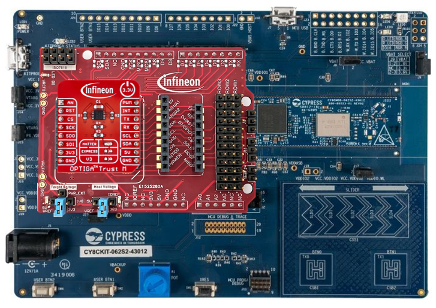
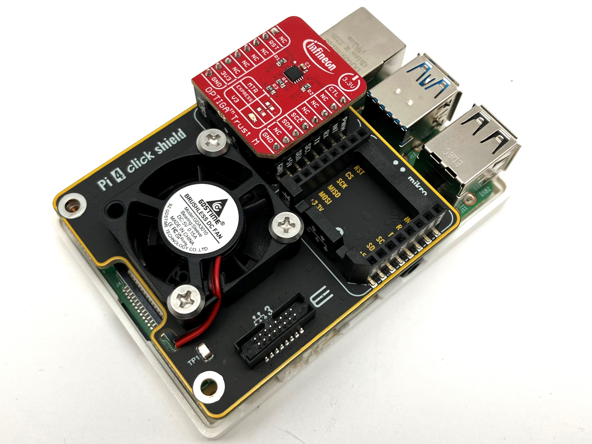

# OPTIGA™ Trust M Getting Started Guide

## Description

This repository contains one of the Application Notes for [OPTIGA™ Trust M](https://github.com/Infineon/optiga-trust-m) security chip.

Note: Please be aware that a direct download of the repository as zip **will NOT work**. Instead download either the latest [release](https://github.com/Infineon/getstarted-optiga-trust-m/releases/latest) or use `git clone --recurse-submodules https://github.com/Infineon/getstarted-optiga-trust-m` command to pull all the submodules. 

Three embedded evaluation kits are supported and listed here:

1. [PSOC™ 62S2 Wi-Fi BT Pioneer Kit](https://www.infineon.com/cms/en/product/evaluation-boards/cy8ckit-062s2-43012/) in combination with the [OPTIGA™ Trust Adapter](https://www.infineon.com/cms/en/product/evaluation-boards/optiga-trust-adapter/) and any [OPTIGA™ Trust M Shield](https://www.infineon.com/cms/en/product/security-smart-card-solutions/optiga-embedded-security-solutions/optiga-trust/optiga-trust-m-sls32aia/)
2. [OPTIGA™ Trust M Evaluation Kit](https://www.infineon.com/cms/de/product/evaluation-boards/optiga-trust-m-eval-kit/)
3. [OPTIGA™ Trust M IoT Security Development Kit](https://www.infineon.com/cms/en/product/evaluation-boards/optiga-trust-m-iot-kit/)

Additionally, you can choose to evaluate the OPTIGA™ Trust M on a Raspberry Pi and the Linux based application- and toolset. This is documented in a [separate repository](https://github.com/Infineon/linux-optiga-trust-m).

[OPTIGA™ Trust M Shields in combination with PSOC™ 62S2 Wi-Fi BT Pioneer Kit](psoc62_cy8ckit_mikrobus/README.md) | [OPTIGA™ Trust M Shields in combination with Raspberry Pi](https://github.com/Infineon/linux-optiga-trust-m) | [OPTIGA™ Trust M Evaluation Kit](xmc4800_evaluation_kit/README.md) |                                          [OPTIGA™ Trust M IoT Security Development Kit](psoc62_secure_development_kit/README.md)  | 
| :-------------------------------------------------------------------------------------------------------------------------------------------------------------------------: | :-------------------------------------------------------------------------------------------------------------------------------------------------------------------------: | :------------------------------------------------------------------------------------------------------------------------------------------------------------------------------: | :-------------------------------------------------------------------------------------------------------: | 
|  |  |  |   | 
| Active and Preferred | Active and Preferred | Not Recommended for New Designs | Not Recommended for New Designs |

## License
This project is licensed under the Creative Commons License - see the [LICENSE](LICENSE) file for details
