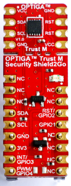
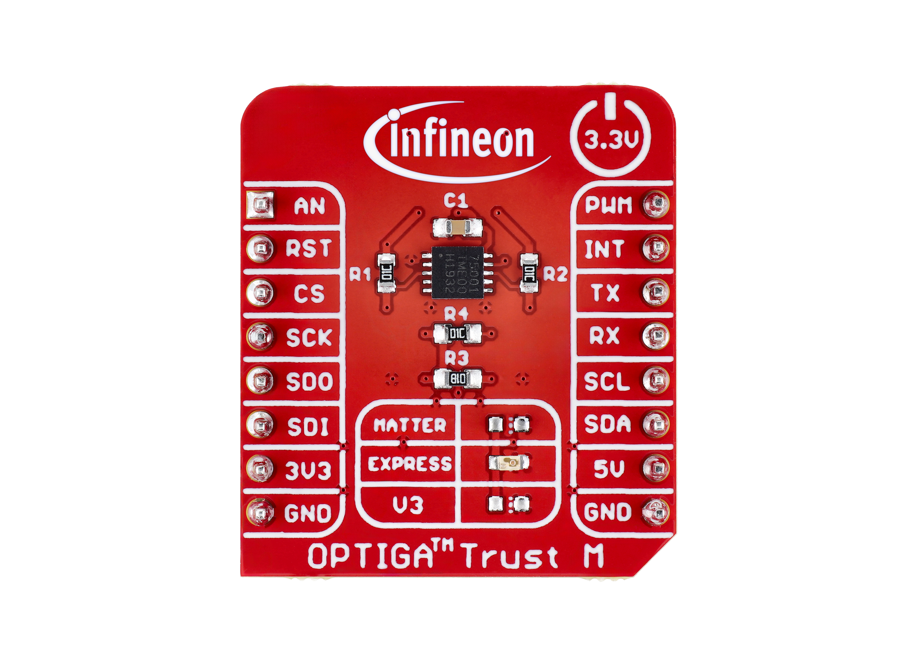
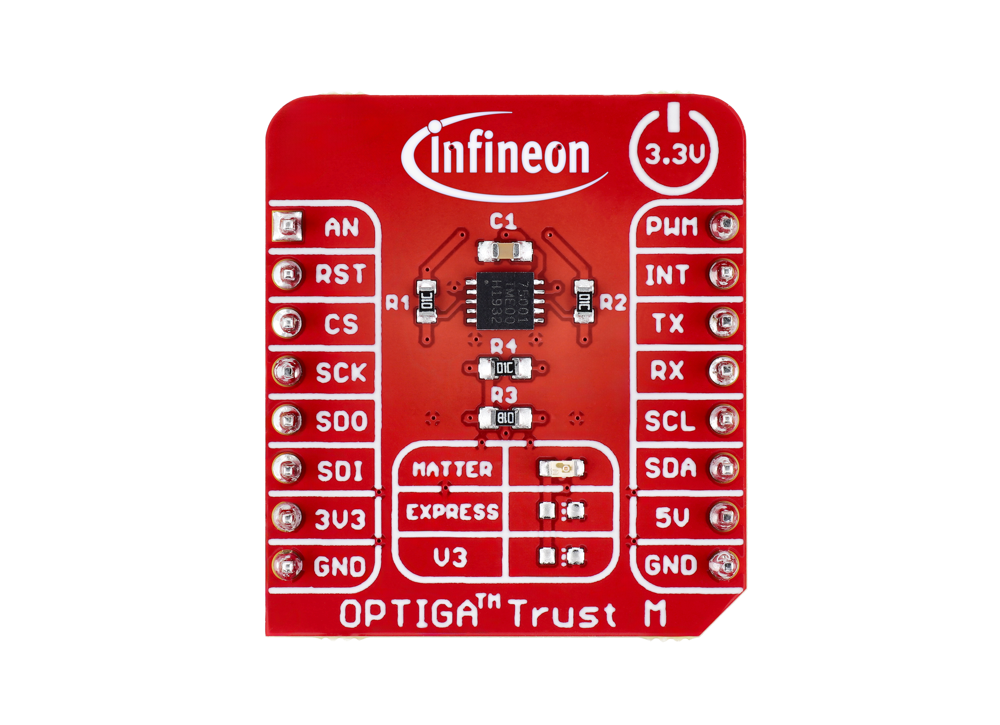
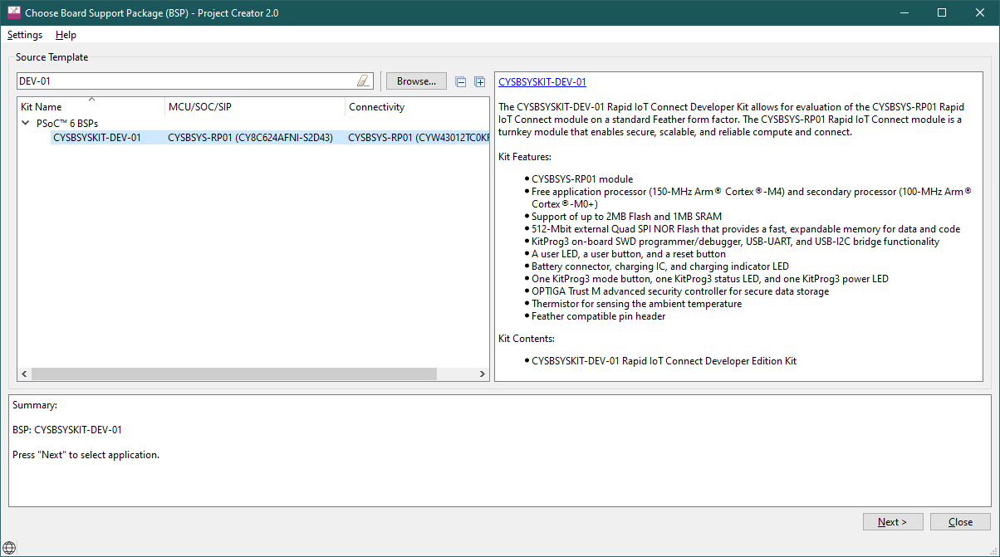
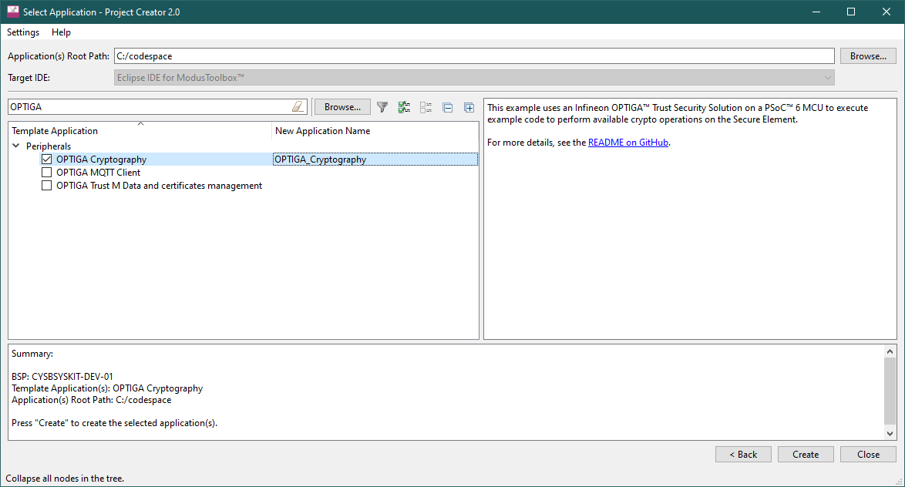
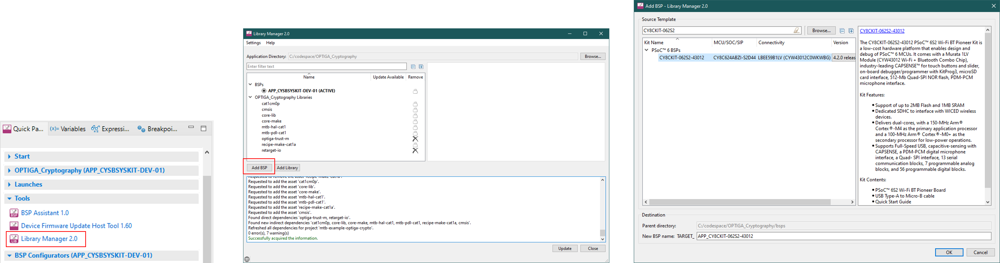
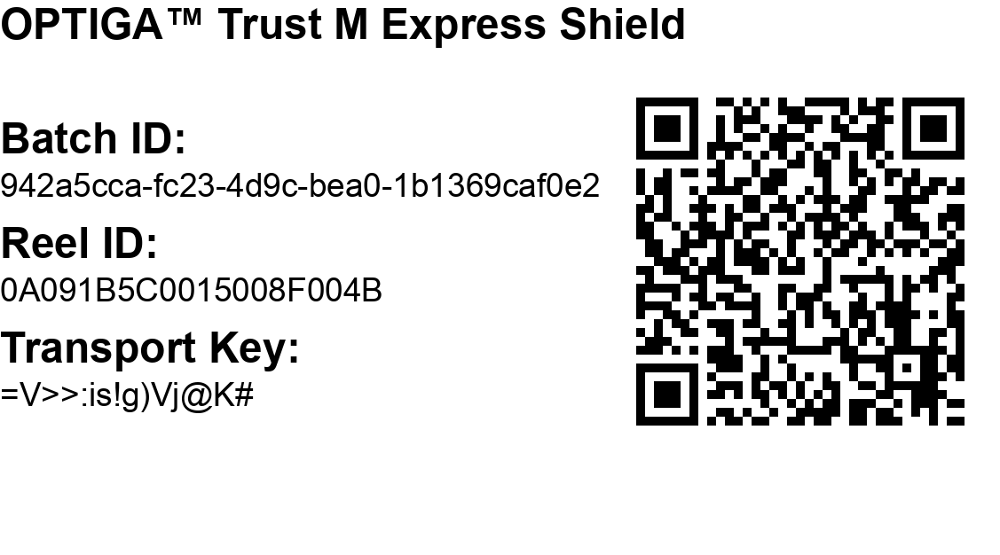
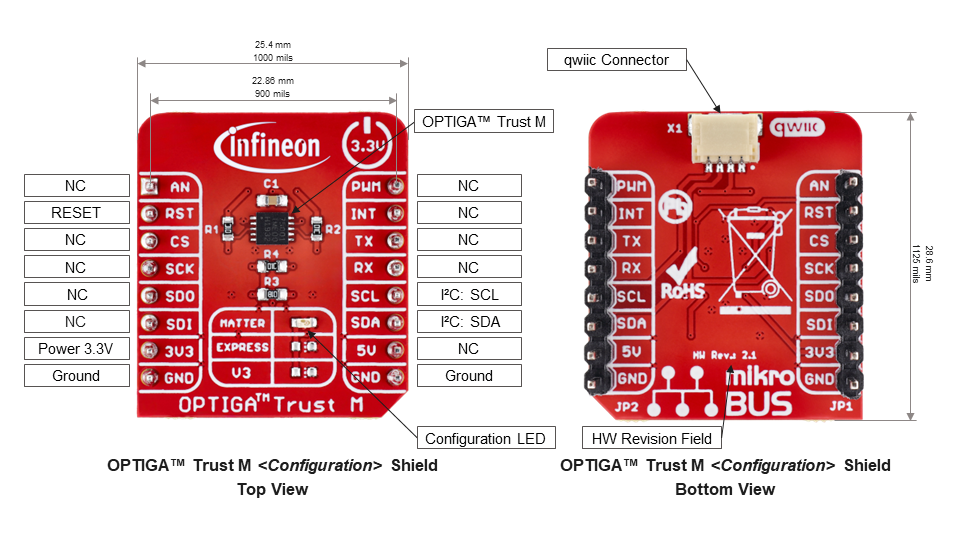

# Get Started with OPTIGA™ Trust M Shields and the PSoC&trade; 62S2 Wi-Fi BT Pioneer Kit

- [Get Started with OPTIGA™ Trust M Shields and the PSoC™ 62S2 Wi-Fi BT Pioneer Kit](#get-started-with-optiga-trust-m-shields-and-the-psoc-62s2-wi-fi-bt-pioneer-kit)
  - [Introduction](#introduction)
  - [Develop your own ModusToolbox™ Application for OPTIGA™ Trust M (*OPTIGA™ Trust M v3/Express/MTR*)](#develop-your-own-modustoolbox-application-for-optiga-trust-m-optiga-trust-m-v3expressmtr)
  - [Experience CIRRENT™ Cloud-ID (*OPTIGA™ Trust M Express Only*)](#experience-cirrent-cloud-id-optiga-trust-m-express-only)
  - [Support material](#support-material)

## Introduction

This section is based on the [PSoC&trade; 62S2 Wi-Fi BT Pioneer Kit](https://www.infineon.com/cms/en/product/evaluation-boards/cy8ckit-062s2-43012/) in combination with the [OPTIGA&trade; Trust Adapter](https://www.infineon.com/cms/en/product/evaluation-boards/optiga-trust-adapter/).

Addtionally, any one of the following OPTIGA&trade; Trust M Shields is needed:

|                                                  [OPTIGA&trade; Trust M Shield2Go](https://www.infineon.com/cms/en/product/evaluation-boards/s2go-security-optiga-m/)                                                   |                                          [OPTIGA&trade; Trust M Express Shield](https://www.infineon.com/optiga-trust-m-express-shield)                                           | [OPTIGA&trade; Trust M MTR Shield](https://www.infineon.com/optiga-trust-m-mtr-shield) |
| :-------------------------------------------------------------------------------------------------------------------------------------------------------------------------: | :------------------------------------------------------------------------------------------------------------------------------------------------------------------------------: | :--------------------------------------------------------------------------------------------------------------------------: |
|  |  |             |

One of these shields needs to be plugged into its designated slot on the OPTIGA&trade; Trust Adapter.

For all shields, the remaining content of this ReadMe applies. 
For the OPTIGA&trade; Trust M MTR Shield and Matter applications, an additional, separate ReadMe & Setup exists: [see here](matter/README.md).

## Develop your own ModusToolbox™ Application for OPTIGA™ Trust M (*OPTIGA™ Trust M v3/Express/MTR*)

> [!NOTE]
> This has been tested with ModusToolox™ Version 3.0.

> [!WARNING]
> Currently, the PSOC™ 62S2 Wi-Fi BT Pioneer Kit (target `CY8CKIT-062S2-43012`) is not listed as one of the supported kits for OPTIGA Trust M Example Applications.
> However, it is possible to start with one of the supported kits and change the Board Support Pacakge (BSP) to this specific kit. This is experimental and is not fully tested.

[Infineon ModusToolbox™](https://www.infineon.com/cms/en/design-support/tools/sdk/modustoolbox-software/) is a collection of easy-to-use software and tools enabling rapid development of Infineon MCUs, covering applications from embedded sense and control to wireless and cloud-connected systems using AIROC™ Wi-Fi, AIROC™ Bluetooth® and AIROC™ Wi-Fi and Combo devices.
In order to experience all available code examples demonstrating the usage of OPTIGA™ Trust M on the IoT Security Development Kit you need to download and install the software. Please refer for this to the followig documents:

1. [ModusToolbox™ Installation Guide](https://www.infineon.com/cms/en/design-support/tools/sdk/modustoolbox-software/#!?fileId=8ac78c8c7d718a49017d99a20342316d)
2. [Eclipse IDE for ModusToolbox™ Quick Start Guide](https://www.infineon.com/cms/en/design-support/tools/sdk/modustoolbox-software/#!?fileId=8ac78c8c7d718a49017d99a11923313b)

There are currently three released Code Examples for OPTIGA™ Trust M:

1. [OPTIGA™ Trust M: Cryptography](https://github.com/Infineon/mtb-example-optiga-crypto)
2. [OPTIGA™ Trust M: MQTT Client](https://github.com/Infineon/mtb-example-optiga-mqtt-client)
3. [OPTIGA™ Trust M: Power management](https://github.com/Infineon/mtb-example-optiga-power-management)
4. [OPTIGA™ Trust M: Data and certificates management](https://github.com/Infineon/mtb-example-optiga-data-management)

In the nutshell, the sequence below demonstrates generic steps to make the code example run, for other than **[OPTIGA™ Trust M: Cryptography](https://github.com/Infineon/mtb-example-optiga-crypto)** examples the process is similar apart from the example name. For settings and individual examples steps please refer to their README's on GitHub

* Start Eclipse IDE for ModusToolbox™

* Create **New Application**: in Quick Panel click on "New application"

* Choose your BSP:
Type "DEV-01" into the dialog and choose **CYSBSYSKIT-DEV-01**.
Click on **Next** to continue.

* Choose Peripherals and find the **OPTIGA Cryptography** example.

* Select your example application and change the used Board Support Package (BSP)
  1. Launch the Library Manager via the MTB Quick Panel
  2. Click "Add BSP"
  3. In the new window, search for `CY8CKIT-062S2-43012`, select the correct BSP and click "OK"
  4. Select the "APP_CY8CKIT-062S2-43012" as Active BSP by clicking on it and then "Update"
  5. After it completes, "Close" the window

* Compile and run. See the [README.md](https://github.com/Infineon/mtb-example-optiga-crypto/blob/master/README.md) for more information about the example

## Experience CIRRENT&trade; Cloud-ID (*OPTIGA™ Trust M Express Only*)

CIRRENT™ Cloud ID is a unique  approach to device-to-cloud authentication, making it easier, more cost effective, and more secure by automating cloud provisioning of device certificates.  In the past, device authentication has been an expensive, custom IT process on the manufacturing line. With Cloud ID, it can now be a simple, robust, flexible, and secure cloud-to-cloud provisioning process.

Each OPTIGA™ Trust M Express Shield comes with a Reel Registration QR Code which shall provide an initial experience for claiming a real OPTIGA™ Trust M Express reel ordered from Infineon or its distribution partners. The Figure below depicts a Sample Code:

</a>

Please mark your QR Code as it's uniquely identifies your board and can be used to retrive the certificate stored on the OPTIGA Trust M device as part of the step-by-step guidance. The latter demonstrates how to use that QR code and get your certificate in the [Steps to complete the virtual developer kit](https://documentation.infineon.com/cirrent/docs/cid/quick-start-cloud-id-virtual-dev-kit#steps-to-complete-the-virtual-developer-kit) of the official **CIRRENT™ Cloud ID Quick Start Guide**

Find more information about CIRRENT™ Cloud ID on the [official product page](https://www.infineon.com/cms/en/design-support/service/cloud/cirrent-cloud-id/)

## Support material

### OPTIGA Trust M \<*Configuration*\> Shield Layout

* [PSoC&trade; 62S2 Wi-Fi BT Pioneer Kit Quickstart Guide](https://www.infineon.com/dgdl/Infineon-CY8CKIT-062S2-43012_PSoC_62S2_Wi-Fi_BT_Pioneer_Kit_Quick_Start_Guide-UserManual-v01_00-EN.pdf?fileId=8ac78c8c7d0d8da4017d0f01cf1d192c)
* [OPTIGA&trade; Trust Adapter Schematics (preliminary version)](../assets/IFXCSS-0058_OPTIGA_Trust-Adapter_1v1_SCH.PDF)
* [OPTIGA&trade; Trust M Shield Schematics](../assets/optiga_trust_m_shield_schematics.pdf)
* [OPTIGA&trade; Trust M Host-Software & Documentation](https://www.github.com/Infineon/optiga-trust-m)
