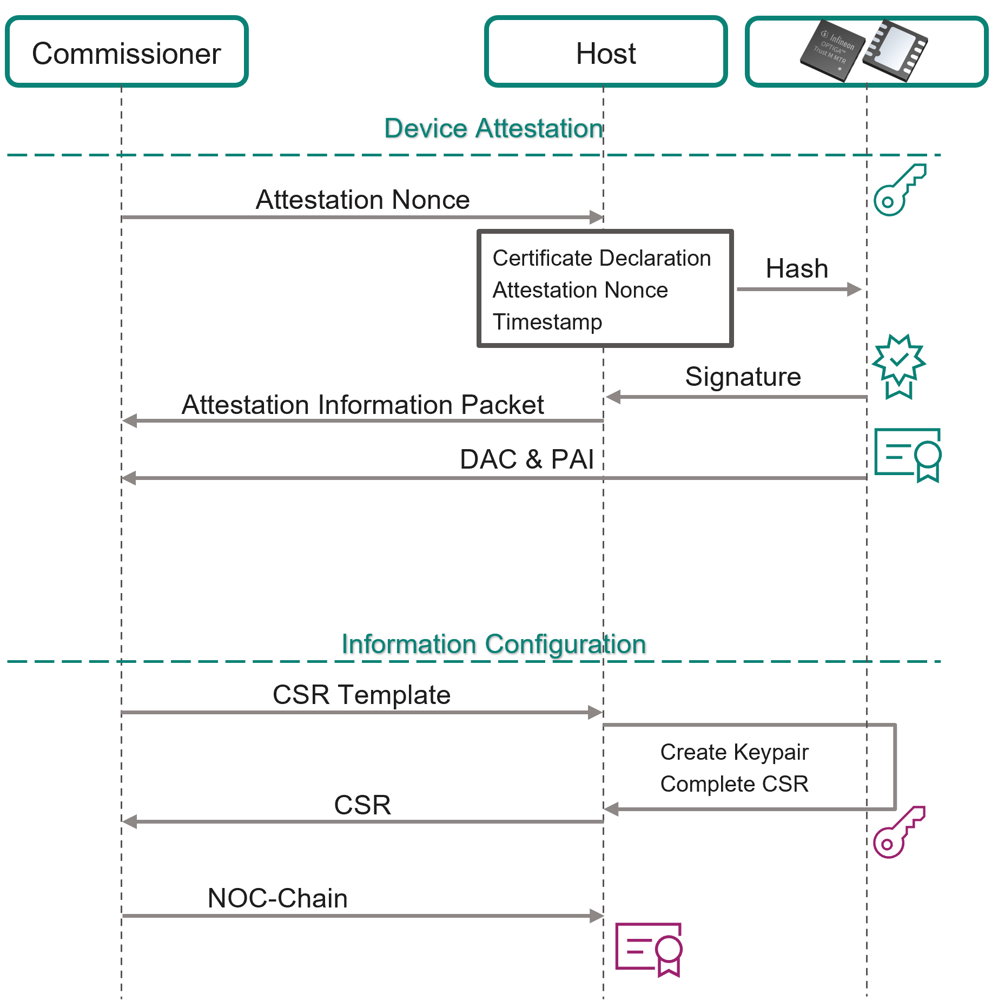

# Get Started with OPTIGA™ Trust M MTR and the PSOC™ 62S2 Pioneer Kit


## Description

This repository contains instructions on how to get started with the [OPTIGA™ Trust M MTR Shield](https://www.infineon.com/optiga-trust-m-mtr-shield) together with the [PSOC™ 62S2 Pioneer Kit](https://www.infineon.com/cms/en/product/evaluation-boards/cy8ckit-062s2-43012) ( `CY8CKIT-062S2-43012`). The goal is to replicate a Matter Smart-Lock application.

The PSOC™ 6 board needs to be flashed with a specific software image. Then it will use the pre-provisioned Matter Development Credentials on the [OPTIGA™ Trust M MTR](https://www.infineon.com/optiga-trust-m-mtr) to attestate itself as a valid Matter Smart-Lock. The device can be added to your Smart-Home ecosystem via a Matter enabled Smart-Home hub and can then be controlled via your phone. If you "unlock" the Smart-Lock on the controller, the LED on the PSOC™ Board will turn off.

You can find more information about the security chip on the product [web page](https://www.infineon.com/optiga-trust-m-mtr)

## Table of content

- [Get Started with OPTIGA™ Trust M MTR and the PSOC™ 62S2 Pioneer Kit](#get-started-with-optiga-trust-m-mtr-and-the-psoc62s2-pioneer-kit)
  - [Description](#description)
  - [Table of content](#table-of-content)
  - [Step 1. Kit content](#step-1-kit-content)
  - [Step 2. Flash Kit with pre-compiled Matter Application](#step-2-flash-kit-with-pre-compiled-matter-application)
  - [Step 3. Experience the Matter Demo](#step-3-experience-the-matter-demo)
  - [Step 4. Retrieve Matter Productive Credentials from Kudelski Keystream](#step-4-retrieve-matter-productive-credentials-from-kudelski-keystream)
  - [Step 5. Develop your own Matter Application for OPTIGA™ Trust M MTR](#step-5-develop-your-own-matter-application-for-optiga-trust-m-mtr)
  - [Support material](#support-material)

## Step 1. Kit content

The Kit consists of 3 separate pieces of Hardware. If not done already, all three pieces need to be ordered separately.

1. PSOC™ 62S2 Pioneer Kit: [CY8CKIT-062S2-43012](https://www.infineon.com/cms/en/product/evaluation-boards/cy8ckit-062s2-43012)
2. [OPTIGA™ Trust Adapter](https://www.infineon.com/optiga-trust-adapter)
3. [OPTIGA™ Trust M MTR Shield](https://www.infineon.com/optiga-trust-m-mtr-shield)

You will additionally need a Matter enabled smart-home hub to translate the BLE commissioning signal to your phone and add the "Smart-Lock" to your home fabric.
A list of tested Hubs is:

- Raspberry Pi 4B running the [CHIP Tool](https://github.com/project-chip/connectedhomeip/blob/master/docs/guides/chip_tool_guide.md)
- [Apple HomePod Mini](https://www.apple.com/de/homepod-mini/), Needs an Apple iPhone or iPad with iOS 16.1 or later as controller
- [Google Nest Mini, Gen 2](https://store.google.com/de/product/google_nest_mini)

Additionally, a working WiFi Connection is required, to which all devices (Evaluation Kit, Matter Hub & Controller) can connect.

<!-- A Short Youtube video of the kit unpack experience:

TODO: Change to Link to Video once it exists!
[](https://www.youtube.com/watch?v=TSQBHB7JaWg) -->

### OPTIGA™ Trust M MTR Shield Configuration upon arrival

To make the evaluation process simpler, we have pre-configured the OPTIGA™Trust M MTR chip on the shield with Matter Development credentials.

| Object ID | OPTIGA™ Trust M MTR Configuration (Default)                                                                    | OPTIGA™ Trust M MTR Configuration (Shield)                                                                                                                                                                                              |
| --------: | :-------------------------------------------------------------------------------------------------------------------- | :--------------------------------------------------------------------------------------------------------------------------------------------------------------------------------------------------------------------------------------------- |
|    0xE0F0 | ECC NIST P256 Private Key 1                                                                                          | ECC NIST P256 Private Key 1                                                                                                                                                                                                                     |
|    0xE0F1 | ECC NIST P256 Private Key 2                                                                                          | ECC NIST P256 Private Key 2                                                                                                                                                                                                                    |
|    0xE0FC | RSA 2048 Private Key                                                                                                 | RSA 2048 Private Key                                                                                                                                                                                                                          |
|    0xE0E0 | ECC Certificate 1, signed by [IFX Int. CA 306](https://pki.infineon.com/OptigaTrustEccCA306/OptigaTrustEccCA306.crt) | Matter DAC Certificate, signed by [Matter Development PAI FFF1](https://github.com/project-chip/connectedhomeip/blob/4db8c38845ed915657c3dc7ff87dcf09b7efcf6d/credentials/development/attestation/Matter-Development-PAI-FFF1-noPID-Cert.pem) |
|    0xE0E1 | ECC Certificate 2, signed by [IFX Int. CA 306](https://pki.infineon.com/OptigaTrustEccCA306/OptigaTrustEccCA306.crt) | ECC Certificate 2, signed by [IFX Int. CA 306](https://pki.infineon.com/OptigaTrustEccCA306/OptigaTrustEccCA306.crt)                                                                                                                          |
|    0xE0E2 | RSA Certificate 1, signed by [IFX Int. CA 309](https://pki.infineon.com/OptigaTrustRsaCA309/OptigaTrustRsaCA309.crt) | RSA Certificate 1, signed by [IFX Int. CA 309](https://pki.infineon.com/OptigaTrustRsaCA309/OptigaTrustRsaCA309.crt)                                                                                                                          |
|    0xE0E8 | empty                                                                                                                | [Matter Development PAI FFF1 Certificate](https://github.com/project-chip/connectedhomeip/blob/4db8c38845ed915657c3dc7ff87dcf09b7efcf6d/credentials/development/attestation/Matter-Development-PAI-FFF1-noPID-Cert.pem)                       |
|    0xE140 | Plattform Binding Secret                                                                                             | Plattform Binding Secret                                                 |
|    0xF1D0 | Authorization Reference                                                                                              | Authorization Reference                                                 |
|    0xF1E0 | empty                                                                                             |  [Matter Test Certificate Declaration](https://github.com/project-chip/connectedhomeip/blob/4db8c38845ed915657c3dc7ff87dcf09b7efcf6d/credentials/development/cd-certs/Chip-Test-CD-Cert.pem)                                                |

## Step 2. Flash Kit with pre-compiled Matter Application

1. Download the attached [chip-psoc6-lock-example.hex](https://github.com/Infineon/getstarted-optiga-trust-m/raw/main/assets/binaries/chip-psoc6-lock-example.hex) (right-click and Save as...) hex-file to your PC. This hex-file is a pre-compiled image for the PSOC™ 62S2 Board, based on the Matter SDK v1.1. It will use the Matter credentials stored on the OPTIGA™ Trust M MTR.
2. Install the ModusToolbox™ toolset:

> [Infineon ModusToolbox™](https://www.infineon.com/cms/en/design-support/tools/sdk/modustoolbox-software/) is a collection of easy-to-use software and tools enabling rapid development of Infineon MCUs, covering applications from embedded sense and control to wireless and cloud-connected systems using AIROC™ Wi-Fi, AIROC™ Bluetooth® and AIROC™ Wi-Fi and Combo devices.
> In order to experience all available code examples demonstrating the usage of OPTIGA™ Trust M and be able to flash the HEX Image to your kit, you need to download and install the software. Please refer for this to the followig documents:
> [ModusToolbox™ Installation Guide](https://www.infineon.com/cms/en/design-support/tools/sdk/modustoolbox-software/#!?fileId=8ac78c8c7d718a49017d99a20342316d)

3. Go to the Windows Start menu and find the `modus-shell` tool, open it
4. Inside the modus-shell, navigate to the folder where you have downloaded the hex-file. E.g.: `cd ~/Downloads`
5. Connect the PSOC™ 62 Pioneer Kit to your PC via the Micro-USB Cable. Use the Micro-USB port labeled `KITPROG3` on the left side of the board.
6. Assuming you have installed Modustoolbox version 3.2 in the default location, run the following command:

```shell
~/ModusToolbox/tools_3.2/openocd/bin/openocd -s ~/ModusToolbox/tools_3.2/openocd/scripts -c "source [find interface/kitprog3.cfg]; ; source [find target/psoc6_2m.cfg]; psoc6 allow_efuse_program off; psoc6 sflash_restrictions 1; program chip-psoc6-lock-example.hex verify reset exit;"
```

If your installation directory or ModustToolbox™ version differs, replace `<~>` with the installation path for the ModusToolbox™ and `<tools_3.2>` with the correct version.

Your PSOC™ 62S2 Pioneer Kit should now be flashed with the application image to run as Matter v1.1 Smart-Lock Device.

## Step 3. Experience the Matter Demo

### Demo Setup
Unfold one of the following sections, depending on your platform setup:

<details>
<summary>RPi 4: Commissioning via CHIP Tool</summary>

> ℹ
>
> For the [Original see here](https://github.com/project-chip/connectedhomeip/tree/master/examples/lock-app/infineon/psoc6#commissioning-and-cluster-control)
> 
> The guide assumes that you have a complete installation of the Matter SDK on your Raspberry Pi 4B.

### Setting up Chip tool

Once PSOC™ 6 is up and running, we need to set up chip-tool on Raspberry Pi 4 to
perform commissioning and cluster control.

-   Set up python controller.

           $ cd {path-to-connectedhomeip}
           $ ./scripts/examples/gn_build_example.sh examples/chip-tool out/debug

-   Execute the controller.

           $ ./out/debug/chip-tool

### Commissioning over BLE

Run the built executable and pass it the discriminator and pairing code of the
remote device, as well as the network credentials to use.

         $ ./out/debug/chip-tool pairing ble-wifi 1234 ${SSID} ${PASSWORD} 20202021 3840
         Parameters:
         1. Discriminator: 3840
         2. Setup-pin-code: 20202021
         3. Node ID: 1234 (you can assign any node id)
         4. SSID : Wi-Fi SSID
         5. PASSWORD : Wi-Fi Password

#### Notes

Raspberry Pi 4 BLE connection issues can be avoided by running the following
commands. These power cycle the BlueTooth hardware and disable BR/EDR mode.

          $ sudo btmgmt -i hci0 power off
          $ sudo btmgmt -i hci0 bredr off
          $ sudo btmgmt -i hci0 power on

### Cluster control

-   After successful commissioning, use the OnOff cluster command to toggle
    device between On or Off states.

    `$ ./out/debug/chip-tool onoff on 1234 1`

    `$ ./out/debug/chip-tool onoff off 1234 1`

-   Cluster OnOff can also be done using the `USER_BTN1` button on the board.
    This button is configured with `APP_LOCK_BUTTON` in `include/AppConfig.h`.
    Press `USER_BTN1` on the board to toggle between lock and unlock states. The
    Lock/Unlock status of door can be observed with 'LED9' on the board. This
    LED is configured with `LOCK_STATE_LED` in `include/AppConfig.h`.

</details>

<details>
<summary>Apple Homepod Mini: Commissioning via Apple Home</summary>

### Platform Setup
Apart from the flashed PSOC™ 62 Pioneer Kit + OPTIGA™ Trust M MTR you will need a  Matter enabled Apple Hub (e.g. HomePod Mini, HomePod 2nd Gen) and an iPhone or iPad with iOS 16.1 or later to connect to the Apple Smart-home Hub.

Add the Apple HomePod to your Smart-Home system and WiFi. Complete the setup as instructed by Apple and the Home app.

### Add Device to Home

Connect the PSOC™ 62 Pioneer Kit to your PC using the included micro USB cable. Start tracing the UART log-output via your favorite terminal (e.g. PuTTY, TeraTerm) and the virtual COM Port.

Reset the PSOC™ 62 Pioneer Kit once by pressing the black "XRES" button.

The full output trace can be seen [below](#traces).

```plain
CHIP:DL: Device Configuration:
CHIP:DL:   Serial Number: TEST_SN
CHIP:DL:   Vendor Id: 65521 (0xFFF1)
CHIP:DL:   Product Id: 32774 (0x8006)
CHIP:DL:   Product Name: P6-CYW43012 Lock
CHIP:DL:   Hardware Version: 43012
CHIP:DL:   Setup Pin Code (0 for UNKNOWN/ERROR): 20202021
CHIP:DL:   Setup Discriminator (0xFFFF for UNKNOWN/ERROR): 3840 (0xF00)
CHIP:DL:   Manufacturing Date: (not set)
CHIP:DL:   Device Type: 10 (0xA)
CHIP:SVR: SetupQRCode: [MT:8IXS142C00KA0648G00]
CHIP:SVR: Copy/paste the below URL in a browser to see the QR Code:
CHIP:SVR: https://project-chip.github.io/connectedhomeip/qrcode.html?data=MT%3A8IXS142C00KA0648G00
CHIP:SVR: Manual pairing code: [34970112332]
CHIP:DL: Long dispatch time: 441 ms, for event type 2
CHIP:DL: CHIPoBLE advertising started
CHIP:DL: BLEManagerImpl::SetAdvertisingData err:Success
```

Essential is the URL line pointing to the QR Code for the Device Commissioning phase: [https://project-chip.github.io/connectedhomeip/qrcode.html?data=MT%3A8IXS142C00KA0648G00](https://project-chip.github.io/connectedhomeip/qrcode.html?data=MT%3A8IXS142C00KA0648G00)

Open this URL and Scan the presented QR Code via your iPhone, after clicking "Add Accessory" in your Apple Home App:


You will now see additional logging output being generated by the PSOC™ 62 Kit, as it now enters the Device Attestation Phase. In parallel, follow the instructions in the Apple Home App to add the new Matter Accessory to your Matter Smart Home.

> ℹ
> The Home App will ask you, if you want to add the Device even though the "Device has not been certified to work with your home". Press "Add Anyway", as this is related to the Matter Development Credentials, which are pre-provisioned to the OPTIGA™Trust M MTR Shield. As soon as you provision your productive credentials, this message will not show anymore.

### Control Device

You can now "lock" and "unlock" the PSOC™ 62 Kit via your Apple Home App.

- "Unlocked" State is when the User LED (red) is off
- "Locked" State is when the User LED (red) is on

The device will automatically "lock" itself again after a certain time.

</details>

<details>
<summary>Google Nest Mini: Commissioning via Google Home</summary>

### Platform Setup

Apart from the flashed PSOC™ 62 Pioneer Kit + OPTIGA™ Trust M MTR you will need a Matter enabled Google Nest (e.g. Nest Mini, Nest Hub) and an Android Phone or Tablet with Android 9.0 or later.

Add the Google Nest to your Smart-Home system and WiFi. Complete the setup as instructed by Google and the Home app.

### OPTIONAL: Add VID to your Google Developer Console

Google Home only allows Matter devices, which are already registered in the Matter Distributed Compliance Ledger.
One can however add development devices in the Google Developer Console. 

Go to https://console.home.google.com/ and sign in with a Google Account. This must be the same account as the one being used on the Android device and connected to your Smart Home.

Create a new Project or open an existing one.

Follow the steps from "Resources" to "Develop". Then, in the "Setup" field, choose a product name like "smartlock".


The Device type must be set to `Lock`.

The Vendor-ID (VID) must be set to "Test-VID" with the value `0xFFF1`.

The Product ID (PID) must be set to `0x8006`.

Press "Save and Continue" and follow the remaining steps. Skip the "Field Trial" and "Certify" and directly go to "Launch".

Your Google Home Account should now be ready to accept the Smart Lock.

### Add Device to Home

Connect the PSOC™ 62 Pioneer Kit to your PC using the included micro USB cable. Start tracing the UART log-output via your favorite terminal (e.g. PuTTY, TeraTerm) and the virtual COM Port.

Reset the PSOC™ 62 Pioneer Kit once by pressing the black "XRES" button.

The full output trace can be seen [below](#traces).

```plain
CHIP:DL: Device Configuration:
CHIP:DL:   Serial Number: TEST_SN
CHIP:DL:   Vendor Id: 65521 (0xFFF1)
CHIP:DL:   Product Id: 32774 (0x8006)
CHIP:DL:   Product Name: P6-CYW43012 Lock
CHIP:DL:   Hardware Version: 43012
CHIP:DL:   Setup Pin Code (0 for UNKNOWN/ERROR): 20202021
CHIP:DL:   Setup Discriminator (0xFFFF for UNKNOWN/ERROR): 3840 (0xF00)
CHIP:DL:   Manufacturing Date: (not set)
CHIP:DL:   Device Type: 10 (0xA)
CHIP:SVR: SetupQRCode: [MT:8IXS142C00KA0648G00]
CHIP:SVR: Copy/paste the below URL in a browser to see the QR Code:
CHIP:SVR: https://project-chip.github.io/connectedhomeip/qrcode.html?data=MT%3A8IXS142C00KA0648G00
CHIP:SVR: Manual pairing code: [34970112332]
CHIP:DL: Long dispatch time: 441 ms, for event type 2
CHIP:DL: CHIPoBLE advertising started
CHIP:DL: BLEManagerImpl::SetAdvertisingData err:Success
```

Essential is the URL line pointing to the QR Code for the Device Commissioning phase: [https://project-chip.github.io/connectedhomeip/qrcode.html?data=MT%3A8IXS142C00KA0648G00](https://project-chip.github.io/connectedhomeip/qrcode.html?data=MT%3A8IXS142C00KA0648G00)

Open this URL and Scan the presented QR Code via your Android Device, after selecting the tab "Devices" and clicking "Add Device" in your Google Home App.

If the Google Home App does not directly find your device, select "Matter-enabled device" in the device type section.

### Control Device

You can now "lock" and "unlock" the PSOC™ 62 Kit via your Google Home App.

- "Unlocked" State is when the User LED (red) is off
- "Locked" State is when the User LED (red) is on

The device will automatically "lock" itself again after a certain time.

</details>

### Factory Reset

- Commissioned Wi-Fi Credentials can be cleared by pressing `USER_BTN2` button
    on the board. All the data configured on the device during the initial
    commissioning will be deleted and device will be ready for commissioning
    again.

- Pressing the button again within 5 seconds will cancel the factory reset of
    the board.

### How it works

The demo just showed the "Device Commissioning" phase of the Matter Protocol.
As written in the Matter Specification v1.1, the Device Commissioning consists of 7 steps, which the Evaluation Kit (Device / Commissionee) goes trough. The Phone and Smart Home Hub work together (Commissioner) to translate protocols and onboard the device.

1. **Device Discovery**: The PSOC™ 6 advertises itself through Bluetooth Low Energy, and the Comissionier finds them. The Passcode is obtained through scanning the QR-Code.
2. **Security Setup wirth PASE**: Based on the obtained passcode, encryption keys are established between Commissioner and Commissionee using Passcode-Authenticated Session Establishment (PASE).
3. **Device Attestation verification**: The Comissioner establishes the authenticity of the Comissionee as a certified device. Here, the OPTIGA™ Trust M MTR helps the PSOC™ 62, as it holds the relevant keys and certificates. (see Figure below)
4. **Information Configuration**: The Commissioner provides the device information like UTC time and Operational Certificate. Again, the OPTIGA™ Trust M MTR can help with establishing the new NOC Keyset. (see Figure below)
5. **Join Network**: The device is triggered to connect to the operational network (i.e. the local Wi-Fi network). The Commissioner discovers and uses the Devices IPv6 Adress for further communication.
6. **Security Setup with CASE**: A new set of encryption keys is derived using CASE (Certificate Authenticated Session Establishment) between the Device and Commissioner.
7. **Commissioning Complete**: The commissioning is complete and a success-message exchange is triggered using the new CASE-derived keys.



### Traces

<details>
<summary>Sample UART Trace until QR Code</summary>

```log
CHIP:P6: ==================================================

CHIP:P6: chip-p6-lock-example starting Version 1

CHIP:P6: ==================================================

CHIP:DL: BLEManagerImpl::Init() complete
CHIP:DL: EnableStationMode
CHIP:DL: WiFi station mode change: Disabled -> Disabled
CHIP:DL: Starting P6 WiFi layer
WLAN MAC Address : D8:10:68:7A:CC:F8
WLAN Firmware    : wl0: Apr 12 2022 20:39:36 version 13.10.271.287 (760d561 CY) FWID 01-b438e2a0
WLAN CLM         : API: 18.2 Data: 9.10.0 Compiler: 1.36.1 ClmImport: 1.34.1 Creation: 2021-04-26 04:01:15
WHD VERSION      : v2.4.0 : v2.4.0 : GCC 12.2 : 2022-08-04 17:12:02 +0800
CHIP:DL: EnableStationMode
CHIP:DL: Done driving station state, nothing else to do...
CHIP:DL: SetAPMode
CHIP:DL: Setting device name to : "P6_LOCK"
CHIP:P6: Starting Platform Manager Event Loop
CHIP:DL: CHIP event task running
CHIP:DL: Starting P6 WiFi layer
CHIP:DL: EnableStationMode
CHIP:DL: EnableSiving statCHIP:DL: Done driving station state, nothing else to do...
CHIP:SVR: Subscription persistence not supported
CHIP:SVR: Server initializing...
CHIP:FP: Initializing FabricTable from persistent storage
CHIP:TS: Last Known Good Time: 2023-09-25T14:04:42
CHIP:DMG: AccessControl: initializing
CHIP:DMG: Examples::AccessControlDelegate::Init
CHIP:DMG: AccessControl: setting
CHIP:DMG: DefaultAclStorage: initializing
CHIP:DMG: DefaultAclStorage: 0 entries loaded
CHIP:IN: UDP::Init bind&listen port=5540
CHIP:IN: UDP::Init bound to port=5540
CHIP:IN: UDP::Init bind&listen port=5540
CHIP:IN: UDP::Init bound to port=5540
CHIP:IN: BLEBase::Init - setting/overriding transport
CHIP:IN: TransportMgr initialized
CHIP:ZCL: Using ZAP configuration...
CHIP:DMG: Failed to read stored attribute (0, 0x0000_0028, 0x0000_0005: a0
CHIP:DMG: Failed to read stored attribute (0, 0x0000_0028, 0x0000_0010: a0
CHIP:DMG: Failed to read stored attribute (0, 0x0000_002B, 0x0000_0000: a0
CHIP:DMG: Failed to read stored attribute (0, 0x0000_002C, 0x0000_0000: a0
CHIP:DMG: Failed to read stored attribute (0, 0x0000_002C, 0x0000_0001: a0
CHIP:DMG: Failed to read stored attribute (1, 0x0000_0101, 0x0000_0000: a0
CHIP:DMG: AccessControlCluster: initializing
CHIP:ZCL: Initiating Admin Commissioning cluster.
CHIP:ZCL: Door Lock server initialized
CHIP:DMG: Endpoint 0, Cluster 0x0000_0030 update version to 7fa071bb
CHIP:ZCL: Cluster callback: 0x0000_0030
CHIP:ZCL: GeneralDiagnostics: OnDeviceReboot
CHIP:DMG: Endpoint 0, Cluster 0x0000_0033 update version to 3dee0bf4
CHIP:EVL: LogEvent event number: 0x0000000000010000 priority: 2, endpoint id:  0x0 cluster id: 0x0000_0033 event id: 0x3 Sys timestamp: 0x000000000000007D
CHIP:ZCL: DeviceInfoProvider is not registered
CHIP:ZCL: Trying to write invalid Calendar Type
CHIP:ZCL: Failed to write calendar type with error: 0x87
CHIP:DMG: Endpoint 1, Cluster 0x0000_0003 update version to e83335f2
CHIP:ZCL: Cluster callback: 0x0000_0003
CHIP:IN: SecureSession[0x8031590]: Allocated Type:1 LSID:12908
CHIP:SC: Assigned local session key ID 12908
CHIP:SC: Waiting for PBKDF param request
CHIP:DIS: Updating services using commissioning mode 1
CHIP:DIS: CHIP minimal mDNS started advertising.
CHIP:DL: Using wifi MAC for hostname
CHIP:DIS: Advertise commission parameter vendorID=65521 productID=32774 discriminator=3840/15 cm=1
CHIP:DIS: Responding with _matterc._udp.local
CHIP:DIS: Responding with 25B12C84D299022C._matterc._udp.local
CHIP:DIS: Responding with F8CC7A6810D8.local
CHIP:DIS: Responding with F8CC7A6810D8.local
CHIP:DIS: Responding with _V65521._sub._matterc._udp.local
CHIP:DIS: Responding with _S15._sub._matterc._udp.local
CHIP:DIS: Responding with _L3840._sub._matterc._udp.local
CHIP:DIS: Responding with _CM._sub._matterc._udp.local
CHIP:DIS: Responding with 25B12C84D299022C._matterc._udp.local
CHIP:DIS: CHIP minimal mDNS configured as 'Commissionable node device'; instance name: 25B12C84D299022C.
CHIP:DIS: mDNS service published: _matterc._udp
CHIP:DIS: Updating services using commissioning mode 1
CHIP:DIS: CHIP minimal mDNS started advertising.
CHIP:DL: Using wifi MAC for hostname
CHIP:DIS: Advertise commission parameter vendorID=65521 productID=32774 discriminator=3840/15 cm=1
CHIP:DIS: Responding with _matterc._udp.local
CHIP:DIS: Responding with 25B12C84D299022C._matterc._udp.local
CHIP:DIS: Responding with F8CC7A6810D8.local
CHIP:DIS: Responding with F8CC7A6810D8.local
CHIP:DIS: Responding with _V65521._sub._matterc._udp.local
CHIP:DIS: Responding with _S15._sub._matterc._udp.local
CHIP:DIS: Responding with _L3840._sub._matterc._udp.local
CHIP:DIS: Responding with _CM._sub._matterc._udp.local
CHIP:DIS: Responding with 25B12C84D299022C._matterc._udp.local
CHIP:DIS: CHIP minimal mDNS configured as 'Commissionable node device'; instance name: 25B12C84D299022C.
CHIP:DIS: mDNS service published: _matterc._udp
CHIP:IN: CASE Server enabling CASE session setups
CHIP:IN: SecureSession[0x8031648]: Allocated Type:2 LSID:12909
CHIP:SC: Allocated SecureSession (0x8031648) - waiting for Sigma1 msg
CHIP:SVR: Joining Multicast groups
CHIP:ZCL: Emitting StartUp event
CHIP:EVL: LogEvent event number: 0x0000000000010001 priority: 2, endpoint id:  0x0 cluster id: 0x0000_0028 event id: 0x0 Sys timestamp: 0x0000000000000161
CHIP:SVR: Server Listening...
CHIP:P6: Current Software Version: 1
CHIP:DL: Device Configuration:
CHIP:DL:   Serial Number: TEST_SN
CHIP:DL:   Vendor Id: 65521 (0xFFF1)
CHIP:DL:   Product Id: 32774 (0x8006)
CHIP:DL:   Product Name: P6-CYW43012 Lock
CHIP:DL:   Hardware Version: 43012
CHIP:DL:   Setup Pin Code (0 for UNKNOWN/ERROR): 20202021
CHIP:DL:   Setup Discriminator (0xFFFF for UNKNOWN/ERROR): 3840 (0xF00)
CHIP:DL:   Manufacturing Date: (not set)
CHIP:DL:   Device Type: 10 (0xA)
CHIP:SVR: SetupQRCode: [MT:8IXS142C00KA0648G00]
CHIP:SVR: Copy/paste the below URL in a browser to see the QR Code:
CHIP:SVR: https://project-chip.github.io/connectedhomeip/qrcode.html?data=MT%3A8IXS142C00KA0648G00
CHIP:SVR: Manual pairing code: [34970112332]
CHIP:DL: Long dispatch time: 441 ms, for event type 2
CHIP:DL: CHIPoBLE advertising started
CHIP:DL: BLEManagerImpl::SetAdvertisingData err:Success
```

</details>

## Step 4. Retrieve Matter Test Credentials from Kudelski Keystream

### Retrieval Process

Go to [www.osts.infineon.com/trustm/home](https://osts.infineon.com/trustm/home). You will need to register with Infineon's OSTS (Online Tools and Services).

Here you will find the instructions to register with Infineon and our partner Kudelski IoT. After a complete registration, you can claim your device certificates from Kudelski keySTREAM. Additionally, you will find more documentation and application notes on the use and integration of the OPTIGA™ Trust M MTR.

As input for the claiming you will need your Reel-ID. The QR Code on the backside of the packaging box of the OPTIGA™ Trust M MTR Shield contains this Reel-ID for your shield. Either scan the QR Code with your phone to retrieve the ID or manually type the ID as printed next to the QR Code.

### Late-stage Provisioning
Two options exist to provision Matter Credentials from Kudelski IoT to the OPTIGA™ Trust M MTR. 

The first option ([Evaluation Solution](#evaluation-solution-psoc-6-only)) is based on the PSOC™ 62S2 WiFi-BT Pioneer Kit and the OPTIGA™ Trust Python Library. With this solution, you are able to provision a single OPTIGA™ Trust M MTR Chip. It is perfect for the evaluation phase, as it does not require any extra hardware.

The second option ([Productive Solution](#productive-solution-requries-raspberry-pi-or-other-linux-system)) is more advanced and powerful, but requires a Raspberry Pi as "Provisioning Harness". If you have advanced from the Evaluation Phase, this is the way to go.

#### Evaluation solution (PSOC™ 6 only)

> [!NOTE]
> This only works out-of-the-box with OPTIGA™ Trust M MTR Shields with HW-Rev > 2.1

##### 1. Flash the OPTIGA™ Trust M Data Management Example

1. Download the attached [mtb-example-optiga-data-management-cy8ckit.hex](https://github.com/Infineon/getstarted-optiga-trust-m/raw/main/assets/binaries/mtb-example-optiga-data-management-cy8ckit.hex) (right-click and Save as...) hex-file to your PC. This hex-file is a pre-compiled image for the PSOC™ 62S2 Board based on the [OPTIGA™ Trust M Data Managment MTB Example](https://github.com/Infineon/mtb-example-optiga-data-management). 
2. ModusToolbox™ should already be installed. If not, check [Step 2](#step-2-flash-kit-with-pre-compiled-matter-application) for instructions
3. Go to the Windows Start menu and find the `modus-shell` tool, open it
4. Inside the modus-shell, navigate to the folder where you have downloaded the hex-file. E.g.: `cd ~/Downloads`
5. Connect the PSOC™ 62 Pioneer Kit to your PC via the Micro-USB Cable. Use the Micro-USB port labeled `KITPROG3` on the left side of the board.
6. Assuming you have installed Modustoolbox version 3.2 in the default location, run the following command:

```shell
~/ModusToolbox/tools_3.2/openocd/bin/openocd -s ~/ModusToolbox/tools_3.2/openocd/scripts -c "source [find interface/kitprog3.cfg]; ; source [find target/psoc6_2m.cfg]; psoc6 allow_efuse_program off; psoc6 sflash_restrictions 1; program mtb-example-optiga-data-management-cy8ckit.hex verify reset exit;"
```

If your installation directory or ModustToolbox™ version differs, replace `<~>` with the installation path for the ModusToolbox™ and `<tools_3.2>` with the correct version.

##### 2. Programm Matter Credentials using OPTIGA™ Trust Python Library

Python 3 has to be installed. Follow the instructions here https://www.python.org/downloads/ to install.
Additionally, download the [write_matter_credentials.py](https://github.com/Infineon/getstarted-optiga-trust-m/raw/main/assets/scripts/write_matter_credentials.py) Python script and the [requirements.txt](https://github.com/Infineon/getstarted-optiga-trust-m/raw/main/assets/scripts/requirments.txt) file. 

Open a new terminal window and locate the downloaded files (e.g. at ~/Downloads). Install the Python Requirements (py7zr, optigatrust and PyOpenSSL).

```shell
python -m pip install -r requirements.txt
```

The `write_matter_credentials.py` script expects a matching bundle file from Kudelski IoT in the same location where the script is executed. The Bundle File for your Shield can be retrieved using the QR-Code on the Shields Box and the instructions [above](#retrieval-process). 

Optionally, you can replace the Certificate Declaration inside the OPTIGA™ Trust M MTR. The [Test Certificate Declaration](https://github.com/Infineon/linux-optiga-trust-m/blob/development_v3/scripts/matter_provisioning/credentials/Chip-Test-CD-Cert.bin) is already installed. If you want to write the CD, supply the path to the CD Binary File after the scripts name.

```shell
python write_matter_credentials.py [path/to/CD.bin]
```

##### 3. Re-flash the PSOC™ with the Matter Application

The PSOC™ needs to be reflashed with the Matter Application Image. 

Follow the instructions in [Step 2](#step-2-flash-kit-with-pre-compiled-matter-application) or develop your own Matter Application in [Step 5](#step-5-develop-your-own-matter-application-for-optiga-trust-m-mtr)

#### Productive solution (Requries Raspberry Pi or other Linux System)
We have prepared a separate application guide for the late-stage provisioning mechanism. For this, you will need a Raspberry Pi as provisioning harness. This solution is primarly built for Raspberry Pi, but is able to run on any Linux system with little adapations.

Find the Application Guide here: [www.github.com/Infineon/linux-optiga-trust-m/tree/development_v3/scripts/matter_provisioning](https://github.com/Infineon/linux-optiga-trust-m/tree/development_v3/scripts/matter_provisioning)

<!-- Once we have a version 2 of Trust M MTR, add python-provisioning option! -->

## Step 5. Develop your own Matter Application for OPTIGA™ Trust M MTR

Developing a new Matter application most likely starts with the Matter SDK.

To start developing a Matter Application for the OPTIGA™ Trust M MTR together with PSOC™ 6, see the [CHIP Matter SDK Repository](https://github.com/project-chip/connectedhomeip/tree/master/examples/lock-app/infineon/psoc6).

## Support material

[See here](../README.md#support-material)

<!-- ## Troubleshooting -->
